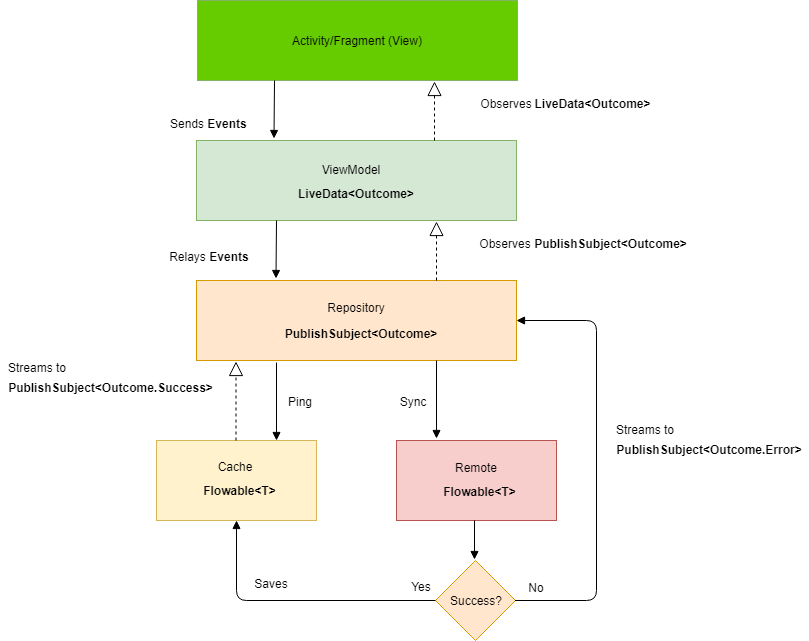

# Fasilie
Money returner for customers. Keeps track of purchased products from retailers during the last 90 days and notices price deductions automatically.

# Core
Some of the app core includes

- **Kotlin** - Fasilie is completely written in Kotlin.

- **Effective Networking** - Using Retrofit, Rx, Room and LiveData, Fasilie is able to handle networking in an effective way.

- **MVVM architecture** - Using lifecycle-aware ViewModels, the view observes changes in the model/repository.

- **Android Architecture Components** - Lifecycle-awareness has been achieved using a combination of LiveData, ViewModels and Room.

 - **Offline first architecture** - All the data is first tried to be loaded from the db and then updated from the server. This ensures that the app is usable even in an offline mode.

 - **Dependency Injection** - Uses injection by utilizing Dagger 2.

# Network

# View
TODO

# ViewModel
TODO

# Repository
TODO

# Build info
  - Android Studio - 3.1 Canary 8
  - Compile SDK - 27
  - Min SDK - 21, Target SDK - 27

# Libraries
* [Android Support Libraries](https://developer.android.com/topic/libraries/support-library/index.html)
* [Dagger 2](https://google.github.io/dagger/)
* [Retrofit](http://square.github.io/retrofit/)
* [OkHttp](http://square.github.io/okhttp/)
* [Picasso](http://square.github.io/picasso/)
* [Stetho](http://facebook.github.io/stetho/)
* [Room](https://developer.android.com/topic/libraries/architecture/room.html)
* [ViewModel](https://developer.android.com/topic/libraries/architecture/viewmodel.html)
* [LiveData](https://developer.android.com/topic/libraries/architecture/livedata.html)
* [RxJava](https://github.com/ReactiveX/RxJava)
* [RxAndroid](https://github.com/ReactiveX/RxAndroid)
